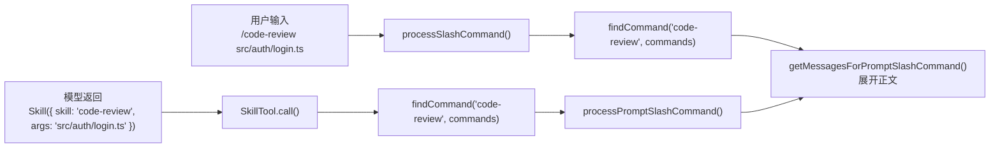

项目中有一份代码审查 Skill：

`/Users/me/shop/.claude/skills/code-review/SKILL.md`

> ---
> name: code-review
> description: 审查登录模块中的安全问题和错误处理
> allowed-tools:
>   - Read
>   - Grep
> context: inline
> ---
>
> 阅读指定文件及其直接依赖，重点检查：
>
> 1. 身份校验是否可能被绕过；
> 2. 登录失败是否泄露敏感信息；
> 3. 错误处理是否遗漏安全审计日志。
>
> 审查目标：$ARGUMENTS

随后在 `/Users/me/shop` 中启动 Claude Code，并输入「检查 `src/auth/login.ts` 的登录逻辑」。

这次只追踪默认的运行方式：Skill 的正文展开到当前主会话中，后续仍由当前 Agent 继续调用 Tool。

先把这次运行最关键的两轮消息并排放出来。后面的源码只验证这张快照是怎样形成的。

第一轮请求中，与 Skill 有关的两条关键消息是用户问题和 Skill 目录：

```javascript
[
  {
    type: 'user',
    message: {
      role: 'user',
      content: '检查 src/auth/login.ts 的登录逻辑',
    },
  },
  {
    type: 'user',
    isMeta: true,
    message: {
      role: 'user',
      content: `<system-reminder>
The following skills are available for use with the Skill tool:

- code-review: 审查登录模块中的安全问题和错误处理
</system-reminder>`,
    },
  },
]
```

这里还没有「身份校验是否可绕过」等审查清单。因此模型只能根据 `code-review` 的名称和描述决定是否调用，模型可能返回：

```javascript
{
  type: 'tool_use',
  id: 'toolu_skill_01',
  name: 'Skill',
  input: {
    skill: 'code-review',
    args: 'src/auth/login.ts',
  },
}
```

`tool_use` 调用完成后，下一轮会新增 Tool Result、完整展开的 Skill 正文和权限附件。下面先列出前两项。

```javascript
[
  {
    type: 'user',
    message: {
      role: 'user',
      content: [{
        type: 'tool_result',
        tool_use_id: 'toolu_skill_01',
        content: 'Launching skill: code-review',
      }],
    },
  },
  {
    type: 'user',
    isMeta: true,
    message: {
      role: 'user',
      content: [{
        type: 'text',
        text: `Base directory for this skill: /Users/me/shop/.claude/skills/code-review

阅读指定文件及其直接依赖，重点检查：
1. 身份校验是否可能被绕过；
2. 登录失败是否泄露敏感信息；
3. 错误处理是否遗漏安全审计日志。

审查目标：src/auth/login.ts`,
      }],
    },
  },
]
```

到第二轮，模型才有足够信息生成 `Read('/Users/me/shop/src/auth/login.ts')`、`Grep('audit|login failed|authentication')` 这类实际操作。

围绕这两轮消息，运行过程中会发生六次变化：

1. 启动阶段读取 `SKILL.md`；
2. 文件被保存成一个 `Command` 对象；
3. 第一轮只把 `code-review` 的名称和描述发给模型；
4. 模型返回一次 `Skill` Tool Use；
5. `SkillTool.call()` 展开完整正文；
6. 下一轮模型读到审查步骤，再调用 `Read`、`Grep`。


图中 `getCommands()` 的输出不是原始的 `SKILL.md` 文件，而是一条名为 `codeReviewCommand` 的运行时记录。后面目录展示、模型调用和 `/code-review` 都会按这个名字查找它，因此先把这层转换放在眼前。

## `Command`：Skill 进入运行时后的登记项

这一篇里的 `Command` 保存一个能力的名称、类型、描述，以及被选中后应当如何处理。`commands` 是这些登记项组成的数组，`findCommand()` 负责按名称或别名取出其中一项。

源码位置：`src/commands.ts:688-698`

```javascript
// src/commands.ts:688-698
export function findCommand(commandName, commands) {
  // commandName => 'code-review'
  // commands 中包含 => {
  //   type: 'prompt',
  //   name: 'code-review',
  //   description: '审查登录模块中的安全问题和错误处理',
  //   allowedTools: ['Read', 'Grep'],
  //   context: undefined,
  //   source: 'projectSettings',
  // }
  return commands.find(command =>
    command.name === commandName ||
    getCommandName(command) === commandName ||
    command.aliases?.includes(commandName),
  )
  // => codeReviewCommand
}
```

同一条 `codeReviewCommand` 有两种抵达方式：



源码位置：`src/utils/processUserInput/processUserInput.ts:535-551`、`src/utils/processUserInput/processSlashCommand.tsx:726-730`、`src/tools/SkillTool/SkillTool.ts:615-642`

两条路径共用的是 Prompt Command 的正文展开；差别在入口：斜杠命令由用户直接选择，`Skill` Tool 由模型先从 `skill_listing` 中选择。

`Command` 并不只服务 Skill，源码中的非 `prompt` Command 还可以在 `processSlashCommand()` 里直接执行本地逻辑，不必把一段正文交给模型。本篇后面追踪的 `codeReviewCommand` 则始终是 `type: 'prompt'` 这一个分支。

## 1. 启动阶段从 `getCommands()` 开始加载

执行 `claude` 后，默认命令的 `.action()` 开始组装会话。本篇只追踪项目 Skill 进入 Commands 表的分支，因此从当前工作目录调用 `getCommands()` 开始。

源码位置：`src/main.tsx:1006`、`src/main.tsx:1918-1929`、`src/main.tsx:2022-2030`

```javascript
program.action(async (prompt, options) => {
  // 只保留 Commands 加载分支。
  // prompt => undefined（用户在交互界面中输入）
  // options.permissionMode => 'default'
  const preSetupCwd = getCwd()
  // => '/Users/me/shop'

  const setupPromise = setup(
    preSetupCwd,
    permissionMode,
    allowDangerouslySkipPermissions,
    worktreeEnabled,
    worktreeName,
    tmuxEnabled,
    sessionId,
    worktreePRNumber,
    messagingSocketPath,
  )
  // allowDangerouslySkipPermissions => false
  // worktreeName => undefined
  // tmuxEnabled => false
  // sessionId => undefined
  // worktreePRNumber => undefined
  // messagingSocketPath => undefined
  // setupPromise 完成后会提供本次会话的基础配置。

  const commandsPromise = worktreeEnabled
    ? null
    : getCommands(preSetupCwd)
  // worktreeEnabled => false
  // 因此这里立即执行 getCommands('/Users/me/shop')。

  await setupPromise

  const currentCwd = worktreeEnabled
    ? getCwd()
    : preSetupCwd
  // => '/Users/me/shop'

  const commands = await (
    commandsPromise ?? getCommands(currentCwd)
  )
  // => Commands 表中包含：
  // {
  //   type: 'prompt',
  //   name: 'code-review',
  //   description: '审查登录模块中的安全问题和错误处理',
  // }
})
```

进入 `getCommands()` 后，调用链继续经过 `loadAllCommands()` 和 `getSkills()`。Commands、Skills、Plugin Commands 和 Workflows 会在这里合并成同一个数组。

源码位置：`src/commands.ts:353-386`、`src/commands.ts:449-488`

```javascript
export async function getCommands(cwd) {
  // cwd => '/Users/me/shop'
  const allCommands = await loadAllCommands(cwd)
  // => 包含 codeReviewCommand 的 Command 数组

  const baseCommands = allCommands.filter(
    command =>
      meetsAvailabilityRequirement(command) &&
      isCommandEnabled(command),
  )
  // => 可用 Commands 表中保留 codeReviewCommand

  const dynamicSkills = getDynamicSkills()
  // => []，本例尚未在文件操作中发现额外 Skill

  if (dynamicSkills.length === 0) {
    return baseCommands
  }

  // dynamicSkills 非空时，源码会去重后插入 baseCommands。
}

const loadAllCommands = memoize(async cwd => {
  const [skills, pluginCommands, workflowCommands] =
    await Promise.all([
      getSkills(cwd),
      getPluginCommands(),
      getWorkflowCommands
        ? getWorkflowCommands(cwd)
        : Promise.resolve([]),
    ])

  return [
    ...skills.bundledSkills,
    ...skills.builtinPluginSkills,
    ...skills.skillDirCommands,
    ...workflowCommands,
    ...pluginCommands,
    ...skills.pluginSkills,
    ...COMMANDS(),
  ]
}

async function getSkills(cwd) {
  const [skillDirCommands, pluginSkills] =
    await Promise.all([
      getSkillDirCommands(cwd),
      getPluginSkills(),
    ])

  return {
    skillDirCommands,
    // => [codeReviewCommand]
    pluginSkills,
    bundledSkills: getBundledSkills(),
    builtinPluginSkills:
      getBuiltinPluginSkillCommands(),
  }
}
```

本例的 Skill 来自项目目录，因此下一步看下 `getSkillDirCommands('/Users/me/shop')`。

## 2. `SKILL.md` 被保存成 `Command`

`getSkillDirCommands()` 会计算需要检查的 Skill 目录。下面只截取本次运行命中的项目分支；完整函数还会合并其他来源并去重。

源码位置：`src/skills/loadSkillsDir.ts:638-770`

```javascript
export const getSkillDirCommands = memoize(
  async cwd => {
    const projectSkillsDirs =
      getProjectDirsUpToHome('skills', cwd)
    // => ['/Users/me/shop/.claude/skills']
    // 用户级 ~/.claude/skills 由 userSkillsDir 单独读取，
    // 不属于这组向上查找的项目目录。

    const projectSkillsNested = await Promise.all(
      projectSkillsDirs.map(dir =>
        loadSkillsFromSkillsDir(
          dir,
          'projectSettings',
        ),
      ),
    )

    const projectSkills =
      projectSkillsNested.flat()
    // => [{
    //   filePath:
    //     '/Users/me/shop/.claude/skills/code-review/SKILL.md',
    //   skill: codeReviewCommand,
    // }]

    const skillCommands = projectSkills.map(
      item => item.skill,
    )
    // => [{
    //   type: 'prompt',
    //   name: 'code-review',
    //   description: '审查登录模块中的安全问题和错误处理',
    //   allowedTools: ['Read', 'Grep'],
    //   context: undefined,
    //   source: 'projectSettings',
    //   loadedFrom: 'skills',
    //   skillRoot: '/Users/me/shop/.claude/skills/code-review',
    //   getPromptForCommand: async (args, toolUseContext) => [
    //     {
    //       type: 'text',
    //       text: 'Base directory for this skill: /Users/me/shop/.claude/skills/code-review\\n\\n阅读指定文件及其直接依赖，重点检查：\\n1. 身份校验是否可能被绕过；\\n2. 登录失败是否泄露敏感信息；\\n3. 错误处理是否遗漏安全审计日志。',
    //     },
    //   ],
    // }]

    // 这个中间数组随后会与用户级、托管、额外目录和旧 Commands 合并，
    // 再按真实文件路径去重后返回。
  },
)
```

进入项目目录后，`loadSkillsFromSkillsDir()` 找到 `code-review/SKILL.md`，拆出 Frontmatter 和 Markdown 正文，再调用 `createSkillCommand()`。

源码位置：`src/skills/loadSkillsDir.ts:403-479`

```javascript
async function loadSkillsFromSkillsDir(
  basePath,
  source,
) {
  // 只保留本例的 code-review 目录。
  // basePath => '/Users/me/shop/.claude/skills'
  // source => 'projectSettings'

  const entries = await fs.readdir(basePath)
  // => [Dirent { name: 'code-review', isDirectory: true }]

  const results = await Promise.all(
    entries.map(async entry => {
      if (!entry.isDirectory() && !entry.isSymbolicLink()) {
        return null
      }

      const skillDirPath = join(basePath, entry.name)
      // => '/Users/me/shop/.claude/skills/code-review'
      const skillFilePath = join(skillDirPath, 'SKILL.md')
      // => '/Users/me/shop/.claude/skills/code-review/SKILL.md'

      const content = await fs.readFile(skillFilePath, {
        encoding: 'utf-8',
      })
      // => `---
      // name: code-review
      // description: 审查登录模块中的安全问题和错误处理
      // allowed-tools: [Read, Grep]
      // context: inline
      // ---
      // 阅读指定文件及其直接依赖，重点检查身份校验、敏感信息和安全审计日志。\n\n审查目标：$ARGUMENTS`

      const { frontmatter, content: markdownContent } =
        parseFrontmatter(content, skillFilePath)
      // frontmatter['user-invocable'] => undefined
      // markdownContent => '阅读指定文件及其直接依赖，重点检查身份校验、敏感信息和安全审计日志。\n\n审查目标：$ARGUMENTS'

      const parsed = parseSkillFrontmatterFields(
        frontmatter,
        markdownContent,
        entry.name,
      )
      // parsed.allowedTools => ['Read', 'Grep']
      // parsed.userInvocable => true
      // parsed.executionContext => undefined

      return {
        filePath: skillFilePath,
        skill: createSkillCommand({
          ...parsed,
          skillName: entry.name,
          markdownContent,
          source,
          baseDir: skillDirPath,
          loadedFrom: 'skills',
        }),
      }
    }),
  )

  return results.filter(result => result !== null)
}
```

`createSkillCommand()` 返回的数据大致如下：

```javascript
const codeReviewCommand = {
  type: 'prompt',
  name: 'code-review',
  description:
    '审查登录模块中的安全问题和错误处理',
  allowedTools: ['Read', 'Grep'],
  userInvocable: true,
  isHidden: false,
  context: undefined,
  source: 'projectSettings',
  loadedFrom: 'skills',
  skillRoot:
    '/Users/me/shop/.claude/skills/code-review',
  getPromptForCommand: async function (
    args,
    toolUseContext,
  ) {
    // 调用 Skill 时才会执行。
  },
}
```

Frontmatter 中的 `context: inline` 会转换为默认值 `undefined`；只有 `context: fork` 才保存成 `'fork'`。

`type: 'prompt'` 是 Command 的运行时类型。它表示调用这个 Command 后，要通过 `getPromptForCommand()` 产出一段消息内容；本例的输入是 `src/auth/login.ts`，输出就是后面看到的审查清单。它不表示这里已经向模型发出请求。

当前源码中，本地 `SKILL.md`、内置 Skill、Plugin Skill 和 MCP Skill 都会以 `type: 'prompt'` 放进 Commands 表。`context: fork` 只改变这段 Prompt 后来交给主会话还是子 Agent 执行，不改变它的 `type`。反过来，`type: 'prompt'` 也不等于它一定是 Skill：普通的 `/commit` 等内置 Command 同样使用这个类型，Skill 还需要结合 `loadedFrom`、`source` 等字段识别。

此时完整正文已经从磁盘读入内存，但还没有进入模型上下文。它被 `getPromptForCommand()` 的闭包保留下来，等待 Skill 真正被调用。

同一个 `codeReviewCommand.getPromptForCommand` 在本例中接收参数后，会产出下面这段文本块；此时还没有任何 `Read` 或 `Grep` 调用：

```javascript
await codeReviewCommand.getPromptForCommand(
  'src/auth/login.ts',
  toolUseContext,
)
// => [{
//   type: 'text',
//   text: `Base directory for this skill: /Users/me/shop/.claude/skills/code-review
//
// 阅读指定文件及其直接依赖，重点检查：
// 1. 身份校验是否可能被绕过；
// 2. 登录失败是否泄露敏感信息；
// 3. 错误处理是否遗漏安全审计日志。
//
// 审查目标：src/auth/login.ts`,
// }]
```

`description` 会先用于生成目录；这段返回值则留到模型选择 Skill 后才加入消息。

这里也能接上前面图中的 `/code-review` 路径：`parseSkillFrontmatterFields()` 对未声明的 `user-invocable` 取默认值 `true`，`createSkillCommand()` 将它保存为 `codeReviewCommand.userInvocable: true`。因此用户输入 `/code-review src/auth/login.ts` 时，`getMessagesForSlashCommand()` 允许它进入 `case 'prompt'`，调用同一个 `getMessagesForPromptSlashCommand()` 展开正文。

如果 Frontmatter 写成 `user-invocable: false`，同一个检查会返回 `shouldQuery: false`，用户不能直接执行 `/code-review`；未同时设置 `disable-model-invocation` 时，模型仍可通过 `Skill({ skill: 'code-review' })` 调用它。这个开关控制的是「谁能从入口选择这条 Command」，不改变正文如何展开。

## 3. 用户输入会附带一份 Skill 目录

上面得到的 `codeReviewCommand` 还只在内存的 Commands 表里。继续沿普通输入「检查 `src/auth/login.ts` 的登录逻辑」往下走，才能看到它第一次怎样进入模型请求。

REPL 提交输入后，`handlePromptSubmit()` 交给 `executeUserInput()`。后者取出本次队列中的第一条命令，调用 `processUserInput()`；这个外层函数读取当前权限模式后，再委托给 `processUserInputBase()`。Skill 目录附件正是在这一步收集。

源码位置：`src/utils/handlePromptSubmit.ts:396-496`、`src/utils/processUserInput/processUserInput.ts:85-171`

```javascript
// src/utils/handlePromptSubmit.ts:473-496
async function executeUserInput({
  queuedCommands,
  messages,
  querySource,
  setToolJSX,
  getToolUseContext,
  mainLoopModel,
  setUserInputOnProcessing,
  canUseTool,
  ideSelection,
}) {
  const abortController = createAbortController()
  // => { signal: AbortSignal { aborted: false } }

  const commands = queuedCommands ?? []
  // => [{
  //   value: '检查 src/auth/login.ts 的登录逻辑',
  //   mode: 'prompt',
  //   uuid: 'user_01',
  // }]

  const cmd = commands[0]

  const result = await processUserInput({
    input: cmd.value,
    // => '检查 src/auth/login.ts 的登录逻辑'
    mode: cmd.mode,
    // => 'prompt'
    setToolJSX,
    context: getToolUseContext(
      messages,
      [],
      abortController,
      mainLoopModel,
    ),
    messages,
    // => []
    setUserInputOnProcessing,
    uuid: cmd.uuid,
    // => 'user_01'
    isAlreadyProcessing: false,
    querySource,
    // => 'repl_main_thread'
    canUseTool,
    ideSelection,
    skipSlashCommands: undefined,
    bridgeOrigin: undefined,
    isMeta: undefined,
    skipAttachments: false,
    // 第一条输入需要收集本轮附件
  })
}

// src/utils/processUserInput/processUserInput.ts:139-171
async function processUserInput({
  input,
  mode,
  setToolJSX,
  context,
  pastedContents,
  ideSelection,
  messages,
  uuid,
  isAlreadyProcessing,
  querySource,
  canUseTool,
  skipSlashCommands,
  bridgeOrigin,
  isMeta,
  skipAttachments,
  preExpansionInput,
}) {
  const inputString = typeof input === 'string' ? input : null
  // => '检查 src/auth/login.ts 的登录逻辑'

  const appState = context.getAppState()
  // appState.toolPermissionContext.mode => 'default'

  return await processUserInputBase(
    input,
    mode,
    setToolJSX,
    context,
    pastedContents,
    ideSelection,
    messages,
    uuid,
    isAlreadyProcessing,
    querySource,
    canUseTool,
    appState.toolPermissionContext.mode,
    skipSlashCommands,
    bridgeOrigin,
    isMeta,
    skipAttachments,
    preExpansionInput,
  )
}
```

接下来只需进入 `processUserInputBase()`：普通文本没有以 `/` 开头，且 `skipAttachments` 为 `false`，因此 `shouldExtractAttachments` 为 `true`，随后调用 `getAttachmentMessages()`。

源码位置：`src/utils/processUserInput/processUserInput.ts:495-513`、`src/utils/processUserInput/processUserInput.ts:576-588`

```javascript
async function processUserInputBase(
  input,
  mode,
  setToolJSX,
  context,
  pastedContents,
  ideSelection,
  messages,
  uuid,
  isAlreadyProcessing,
  querySource,
  canUseTool,
  permissionMode,
  skipSlashCommands,
  bridgeOrigin,
  isMeta,
  skipAttachments,
  preExpansionInput,
) {
  const inputString = typeof input === 'string' ? input : null
  // inputString =>
  //   '检查 src/auth/login.ts 的登录逻辑'

  let normalizedInput = input
  // => '检查 src/auth/login.ts 的登录逻辑'

  const shouldExtractAttachments =
    !skipAttachments &&
    inputString !== null &&
    (mode !== 'prompt' || !inputString.startsWith('/'))
  // => true

  const attachmentMessages = shouldExtractAttachments
    ? await toArray(
        getAttachmentMessages(
          inputString,
          context,
          null,
          [],
          messages,
          querySource,
        ),
      )
    : []
  // => [{
  //   type: 'attachment',
  //   attachment: {
  //     type: 'skill_listing',
  //     content: '- code-review: 审查登录模块中的安全问题和错误处理',
  //   },
  // }]

  const result = processTextPrompt(
    normalizedInput,
    [],
    // 本例没有粘贴图片
    [],
    // 本例没有图片粘贴 ID
    attachmentMessages,
    uuid,
    permissionMode,
    isMeta,
  )
  // => {
  //   messages: [
  //     userMessage('检查 src/auth/login.ts 的登录逻辑'),
  //     skillListingAttachmentMessage,
  //   ],
  //   shouldQuery: true,
  // }

  return result
}
```

`getAttachmentMessages()` 会收集多类上下文附件，其中一项就是 Skill 目录。只保留本例对应的附件提供者后，调用关系如下。

源码位置：`src/utils/attachments.ts:871-881`、`src/utils/attachments.ts:2937-2969`

```javascript
async function getAttachments(
  input,
  toolUseContext,
  ideSelection,
  queuedCommands,
  messages,
  querySource,
) {
  // toolUseContext.options.tools 中包含 { name: 'Skill' }
  const abortController = createAbortController()
  // => { signal: AbortSignal { aborted: false } }
  const context = { ...toolUseContext, abortController }

  const allThreadAttachments = [
    maybe(
      'skill_listing',
      () => getSkillListingAttachments(context),
    ),
  ]

  const threadAttachmentResults =
    await Promise.all(allThreadAttachments)

  return threadAttachmentResults
    .flat()
    .filter(attachment => attachment !== undefined)
}

export async function* getAttachmentMessages(
  input,
  toolUseContext,
  ideSelection,
  queuedCommands,
  messages,
  querySource,
) {
  const attachments = await getAttachments(
    input,
    toolUseContext,
    ideSelection,
    queuedCommands,
    messages,
    querySource,
  )
  // input => '检查 src/auth/login.ts 的登录逻辑'
  // querySource => 'repl_main_thread'
  // attachments => [{
  //   type: 'skill_listing',
  //   content: '- code-review: 审查登录模块中的安全问题和错误处理',
  // }]

  for (const attachment of attachments) {
    yield createAttachmentMessage(attachment)
    // => skillListingAttachmentMessage
  }
}
```

现在进入 `getSkillListingAttachments()`。它接收本轮的 `toolUseContext`，先确认本轮存在 `Skill` Tool，再调用 `getSkillToolCommands()` 从已经加载好的 Commands 表筛出可由模型调用的 Prompt Command，最后返回一条 `skill_listing` 附件。

第 1 节启动时，`getCommands()` 先生成一份 `Command[]`，并交给 REPL 作为会话配置。第 3 节准备 `skill_listing` 时，`getSkillToolCommands(cwd)` 会再次通过 `getCommands(cwd)` 取得当前可用 Commands，再筛出模型可调用的 Prompt Command。

这不是重新扫描所有 `SKILL.md`：底层的 `loadAllCommands(cwd)` 有缓存。这里的第二次筛选得到 `localCommands`，其中包含 `code-review`；随后它会再与 MCP Skill 合并成用于生成目录的 `allCommands`。

源码位置：`src/commands.ts:561-581`

源码位置：`src/commands.ts:561-581`、`src/utils/attachments.ts:2661-2750`

```javascript
async function getSkillListingAttachments(
  toolUseContext,
) {
  // toolUseContext.options.tools 中包含 { name: 'Skill' }
  // 因此不会从下面的提前返回分支离开。
  if (
    !toolUseContext.options.tools.some(
      tool => tool.name === 'Skill',
    )
  ) {
    return []
  }

  const cwd = getProjectRoot()
  // => '/Users/me/shop'

  const localCommands =
    await getSkillToolCommands(cwd)
  // => 可供模型调用的 Prompt Commands 中包含 codeReviewCommand

  const agentKey = toolUseContext.agentId ?? ''
  // => ''，主 Agent 没有子 Agent ID

  let sent = sentSkillNames.get(agentKey)
  // => undefined，本次会话第一次生成目录

  if (!sent) {
    sent = new Set()
    sentSkillNames.set(agentKey, sent)
  }
  // => new Set()

  const newSkills = localCommands.filter(
    command => !sent.has(command.name),
  )
  // => [codeReviewCommand]

  for (const command of newSkills) {
    sent.add(command.name)
  }
  // => new Set(['code-review'])

  const contextWindowTokens = 200000
  const content = formatCommandsWithinBudget(
    newSkills,
    contextWindowTokens,
  )
  // => '- code-review: 审查登录模块中的安全问题和错误处理'

  const listing = [{
    type: 'skill_listing',
    content,
    skillCount: 1,
    isInitial: true,
  }]
  // => [{
  //   type: 'skill_listing',
  //   content: '- code-review: 审查登录模块中的安全问题和错误处理',
  //   skillCount: 1,
  //   isInitial: true,
  // }]

  return listing
}
```

`skill_listing` 随后在 `normalizeAttachmentForAPI()` 的 `case 'skill_listing'` 中转换成一条隐藏的 User Message。源码直接创建消息，再交给 `wrapMessagesInSystemReminder()` 包装。

源码位置：`src/utils/messages.ts:3728-3737`、`src/utils/messages.ts:3101-3128`

```javascript
// src/utils/messages.ts:3728-3737
return wrapMessagesInSystemReminder([
  createUserMessage({
    content: `The following skills are available for use with the Skill tool:

- code-review: 审查登录模块中的安全问题和错误处理`,
    isMeta: true,
  }),
])

// src/utils/messages.ts:3101-3116
// 字符串内容会被 wrapInSystemReminder() 包装，最终消息的关键字段为：
{
  type: 'user',
  isMeta: true,
  message: {
    role: 'user',
    content: `<system-reminder>
The following skills are available for use with the Skill tool:

- code-review: 审查登录模块中的安全问题和错误处理
</system-reminder>`,
  },
}
```

第一轮调用模型前，消息数组中与本节相关的两个元素如下：

```javascript
[
  {
    type: 'user',
    message: {
      role: 'user',
      content: '检查 src/auth/login.ts 的登录逻辑',
    },
  },
  {
    type: 'user',
    isMeta: true,
    message: {
      role: 'user',
      content: `<system-reminder>
The following skills are available for use with the Skill tool:

- code-review: 审查登录模块中的安全问题和错误处理
</system-reminder>`,
    },
  },
]
```

其中只有 `code-review` 的名称和描述，没有完整审查步骤，也没有 `$ARGUMENTS` 展开后的内容。

源码还为这份目录设置了预算：按上下文窗口的 token 数折算为字符预算，默认比例是 1%；单条描述最多保留 250 个字符。目录可以帮助模型判断是否需要某个 Skill，又不会让所有 `SKILL.md` 正文从第一轮开始占用上下文。

## 4. 模型返回一次 `Skill` Tool Use

发送给模型的请求有两个不同位置：`messages` 中的 `skill_listing` 告诉模型有哪些 Skill；`tools` 中的 `Skill` Tool Schema 告诉模型可以用什么格式选择它。`queryLoop()` 将两者同时传给 `deps.callModel()`。

源码位置：`src/query.ts:659-667`、`src/tools/SkillTool/SkillTool.ts:293-303`

```javascript
// src/query.ts:659-667
for await (const message of deps.callModel({
  messages: prependUserContext(
    messagesForQuery,
    userContext,
  ),
  // messagesForQuery 中已有：
  // - 用户问题「检查 src/auth/login.ts 的登录逻辑」
  // - 含 code-review 名称和描述的 skill_listing
  tools: toolUseContext.options.tools,
  // 其中 Skill Tool 的输入结构为：
  // {
  //   skill: 'code-review',
  //   args: 'src/auth/login.ts',
  // }
})) {
  yield message
}
```

本地代码没有根据「登录逻辑」自动匹配 `code-review`。模型读到任务、目录和 Tool Schema 后，可能在回答中生成下面这次 Tool Use：

```javascript
const assistantMessage = {
  role: 'assistant',
  content: [{
    type: 'tool_use',
    id: 'toolu_skill_01',
    name: 'Skill',
    input: {
      skill: 'code-review',
      args: 'src/auth/login.ts',
    },
  }],
}
```

这个 Tool Use 只表达了两件事：选择 `code-review`，并把 `src/auth/login.ts` 作为参数。模型还没有执行 `Read` 或 `Grep`。

`queryLoop()` 收集到这段 Tool Use 后，仍然走第 4、5 篇已经出现过的普通 Tool 路径：

源码位置：`src/query.ts:1380-1408`、`src/services/tools/toolOrchestration.ts:19-80`、`src/services/tools/toolOrchestration.ts:118-149`

```javascript
// src/query.ts
const toolUpdates = runTools(
  [skillToolUse],
  assistantMessages,
  canUseTool,
  toolUseContext,
)
// skillToolUse => {
//   name: 'Skill',
//   id: 'toolu_skill_01',
//   input: { skill: 'code-review', args: 'src/auth/login.ts' },
// }
// assistantMessages => [assistantMessage]

for await (const update of toolUpdates) {
  if (update.message) {
    toolResults.push(update.message)
    // 首次得到的 update.message =>
    // tool_result('Launching skill: code-review')
  }
}

// src/services/tools/toolOrchestration.ts
async function* runToolsSerially(
  toolUseMessages,
  assistantMessages,
  canUseTool,
  toolUseContext,
) {
  for (const toolUse of toolUseMessages) {
    // toolUse.name => 'Skill'
    // toolUse.id => 'toolu_skill_01'
    yield* runToolUse(
      toolUse,
      assistantMessage,
      canUseTool,
      toolUseContext,
    )
  }
}
```

`runToolUse()` 会根据名称找到 `SkillTool`，依次完成参数校验、Hook 和权限判断，再调用 `SkillTool.call()`。本例的 `allowed-tools` 不为空，若当前没有匹配的权限规则，界面会先询问是否允许执行这份 Skill；这里按用户允许本次执行继续往下追。

## 5. `SkillTool.call()` 才展开完整正文

进入 `SkillTool.call()` 后，代码根据名称从 Commands 表中重新找到 `codeReviewCommand`，然后调用 `processPromptSlashCommand()`。

源码位置：`src/tools/SkillTool/SkillTool.ts:580-652`

```javascript
async function call(
  { skill, args },
  context,
  canUseTool,
  parentMessage,
) {
  // skill => 'code-review'
  // args => 'src/auth/login.ts'
  // canUseTool => 当前会话的权限确认函数
  // code-review.context => undefined（Frontmatter 的 inline 会归一为默认值）
  // 因此本例不会进入 fork 分支
  // parentMessage 中的 Tool Use ID => 'toolu_skill_01'
  const commandName = skill.trim()
  // => 'code-review'

  const commands = await getAllCommands(context)
  const command = findCommand(
    commandName,
    commands,
  )
  // => codeReviewCommand

  const processedCommand =
    await processPromptSlashCommand(
      commandName,
      args || '',
      commands,
      context,
    )
  // args => 'src/auth/login.ts'
  // processedCommand.shouldQuery => true
  // processedCommand.allowedTools => ['Read', 'Grep']
  // processedCommand.messages => [
  //   commandLoadingMessage,
  //   fullSkillBodyMessage,
  //   commandPermissionsAttachment,
  // ]

  // 后面整理 newMessages。
}
```

`SkillTool.call()` 先把名称、参数和完整 Commands 表交给 `processPromptSlashCommand()`；正文由后者从同一条 `Command` 的 `getPromptForCommand()` 中展开。

源码位置：`src/utils/processUserInput/processSlashCommand.tsx:817-836`

```javascript
export async function processPromptSlashCommand(
  commandName,
  args,
  commands,
  context,
  imageContentBlocks = [],
) {
  // commandName => 'code-review'
  // args => 'src/auth/login.ts'
  // imageContentBlocks => []

  const command = findCommand(commandName, commands)
  // => {
  //   type: 'prompt',
  //   name: 'code-review',
  //   allowedTools: ['Read', 'Grep'],
  //   getPromptForCommand: [Function],
  // }

  if (!command) {
    throw new MalformedCommandError('Unknown command: code-review')
  }

  if (command.type !== 'prompt') {
    throw new Error('Expected a prompt command')
  }

  return getMessagesForPromptSlashCommand(
    command,
    args,
    context,
    [],
    imageContentBlocks,
  )
  // => {
  //   messages: [
  //     {
  //       type: 'user',
  //       message: {
  //         role: 'user',
  //         content: '<command-message>code-review</command-message>\n<command-name>/code-review</command-name>\n<command-args>src/auth/login.ts</command-args>',
  //       },
  //     },
  //     {
  //       type: 'user',
  //       isMeta: true,
  //       message: {
  //         role: 'user',
  //         content: [{
  //           type: 'text',
  //           text: 'Base directory for this skill: /Users/me/shop/.claude/skills/code-review\n\n阅读指定文件及其直接依赖，重点检查：\n\n1. 身份校验是否可能被绕过；\n2. 登录失败是否泄露敏感信息；\n3. 错误处理是否遗漏安全审计日志。\n\n审查目标：src/auth/login.ts',
  //         }],
  //       },
  //     },
  //     {
  //       type: 'attachment',
  //       attachment: {
  //         type: 'command_permissions',
  //         allowedTools: ['Read', 'Grep'],
  //         model: undefined,
  //       },
  //     },
  //   ],
  //   shouldQuery: true,
  //   allowedTools: ['Read', 'Grep'],
  //   model: undefined,
  //   command: codeReviewCommand,
  // }
}
```

这一层只定位并校验 `codeReviewCommand`，正文展开落在 `getMessagesForPromptSlashCommand()` 中；其中的 `command.getPromptForCommand()` 正是启动阶段由 `createSkillCommand()` 保存下来的闭包。

源码位置：`src/utils/processUserInput/processSlashCommand.tsx:827-920`、`src/skills/loadSkillsDir.ts:344-399`

```javascript
async function getMessagesForPromptSlashCommand(
  command,
  args,
  context,
) {
  // command.name => 'code-review'
  // command.allowedTools => ['Read', 'Grep']
  // args => 'src/auth/login.ts'
  const result = await command.getPromptForCommand(
    args,
    context,
  )
  // args => 'src/auth/login.ts'
  // result => [{
  //   type: 'text',
  //   text: 'Base directory for this skill: /Users/me/shop/.claude/skills/code-review\n\n阅读指定文件及其直接依赖，重点检查：\n\n1. 身份校验是否可能被绕过；\n2. 登录失败是否泄露敏感信息；\n3. 错误处理是否遗漏安全审计日志。\n\n审查目标：src/auth/login.ts',
  // }]

  const processed = {
    messages: [
      createUserMessage({
        content: formatCommandLoadingMetadata(
          command,
          args,
        ),
      }),
      createUserMessage({
        content: result,
        isMeta: true,
      }),
      createAttachmentMessage({
        type: 'command_permissions',
        allowedTools: ['Read', 'Grep'],
        model: undefined,
      }),
    ],
    shouldQuery: true,
    allowedTools: ['Read', 'Grep'],
    model: undefined,
    command,
  }
  // processed.shouldQuery => true
  // processed.allowedTools => ['Read', 'Grep']
  // processed.messages[1].message.content => result

  return processed
}

async function getPromptForCommand(
  args,
  toolUseContext,
) {
  // args => 'src/auth/login.ts'

  let finalContent =
    'Base directory for this skill: ' +
    '/Users/me/shop/.claude/skills/code-review\n\n' +
    markdownContent

  finalContent = substituteArguments(
    finalContent,
    args,
    true,
    argumentNames,
  )

  const promptBlocks = [{
    type: 'text',
    text: finalContent,
  }]
  // promptBlocks[0].text => finalContent

  return promptBlocks
}
```

这次调用产生的 `finalContent` 是：

> Base directory for this skill: /Users/me/shop/.claude/skills/code-review
>
> 阅读指定文件及其直接依赖，重点检查：
>
> 1. 身份校验是否可能被绕过；
> 2. 登录失败是否泄露敏感信息；
> 3. 错误处理是否遗漏安全审计日志。
>
> 审查目标：src/auth/login.ts

到这里，`$ARGUMENTS` 已经替换为具体文件，完整正文第一次进入准备发送给模型的消息。

## 6. Skill 正文中引用脚本时

前面的 `code-review` 只有审查说明，因此没有进入 `BashTool`。带脚本的 Skill 需要先写清楚脚本负责什么、何时需要运行。源码中有两种调用时机：

| Skill 正文写法 | 调用 `Bash` 的时机 | 谁决定执行 |
| --- | --- | --- |
| `bash scripts/check-login.sh` | 正文进入下一轮模型消息之后 | 模型产生 `Bash` Tool Use |
| 带 `!` 的嵌入 Shell 代码块 | `getPromptForCommand()` 展开正文时 | 每次加载都要执行的固定前置步骤 |

### 根据任务决定是否运行脚本

下面的 `login-check` 把脚本的用途和触发条件写在正文中。脚本以普通代码行出现，完整正文进入下一轮消息后，模型才会根据当前任务创建 `Bash` Tool Use。

```markdown
---
name: login-check
description: 检查登录模块
allowed-tools:
  - Bash(bash /Users/me/shop/.claude/skills/login-check/scripts/check-login.sh:*)
---

先阅读 $ARGUMENTS 的登录流程。

出现下面任一情况时，运行脚本补充静态检查结果：

- 用户要求执行登录模块检查；
- 代码中出现认证、令牌或密码处理；
- 仅靠阅读不足以确认是否存在硬编码密钥。

运行：

bash ${CLAUDE_SKILL_DIR}/scripts/check-login.sh $ARGUMENTS
```

源码位置：`src/skills/loadSkillsDir.ts:344-402`

```javascript
async function getPromptForCommand(args, toolUseContext) {
  // args => 'src/auth/login.ts'
  // baseDir => '/Users/me/shop/.claude/skills/login-check'
  // loadedFrom => 'skills'
  // allowedTools => [
  //   'Bash(bash /Users/me/shop/.claude/skills/login-check/scripts/check-login.sh:*)',
  // ]

  let finalContent =
    '先阅读 $ARGUMENTS 的登录流程。\n\n' +
    '出现认证、令牌或密码处理时，运行：\n\n' +
    'bash ${CLAUDE_SKILL_DIR}/scripts/check-login.sh $ARGUMENTS\n' +
    '再依据结果完成审查。'

  finalContent = substituteArguments(
    finalContent,
    args,
    true,
    argumentNames,
  )
  // => '先阅读 src/auth/login.ts 的登录流程。\n\n出现认证、令牌或密码处理时，运行：\n\nbash ${CLAUDE_SKILL_DIR}/scripts/check-login.sh src/auth/login.ts\n再依据结果完成审查。'

  finalContent = finalContent.replace(
    /\$\{CLAUDE_SKILL_DIR\}/g,
    baseDir,
  )
  // => '先阅读 src/auth/login.ts 的登录流程。\n\n出现认证、令牌或密码处理时，运行：\n\nbash /Users/me/shop/.claude/skills/login-check/scripts/check-login.sh src/auth/login.ts\n再依据结果完成审查。'

  return [{ type: 'text', text: finalContent }]
}
```

这一步只产生 Skill 正文。代入「检查 `src/auth/login.ts` 的登录逻辑」后，模型读到认证和令牌检查条件，可能在下一轮产生普通 `Bash` Tool Use：

```javascript
{
  type: 'tool_use',
  id: 'toolu_bash_01',
  name: 'Bash',
  input: {
    command:
      'bash /Users/me/shop/.claude/skills/login-check/scripts/check-login.sh src/auth/login.ts',
  },
}
```

它随后走第 4、5 篇已经追过的 Tool 校验、权限与执行链路。

### 每次加载都必须先运行的脚本

有些 Skill 每次展开都需要先运行一段固定的前置检查。此时才会用带 `!` 的嵌入 Shell 代码块：

````markdown
```!
bash ${CLAUDE_SKILL_DIR}/scripts/check-login.sh src/auth/login.ts
```
````

`getPromptForCommand()` 在替换变量后，先根据 Skill 来源决定是否允许自动执行这种 `!` 命令：

源码位置：`src/skills/loadSkillsDir.ts:371-398`

```javascript
if (loadedFrom !== 'mcp') {
  // login-check.loadedFrom => 'skills'
  // 条件 => true
  finalContent = await executeShellCommandsInPrompt(
    finalContent,
    {
      ...toolUseContext,
      getAppState() {
        const appState = toolUseContext.getAppState()
        return {
          ...appState,
          toolPermissionContext: {
            ...appState.toolPermissionContext,
            alwaysAllowRules: {
              ...appState.toolPermissionContext.alwaysAllowRules,
              command: allowedTools,
              // => ['Bash(bash /Users/me/shop/.claude/skills/login-check/scripts/check-login.sh:*)']
            },
          },
        }
      },
    },
    '/login-check',
    shell,
  )
}

return [{ type: 'text', text: finalContent }]
```

MCP Skill 的 `loadedFrom` 值为 `'mcp'`，条件为 `false`，因此正文中的 `!` 代码块不会在加载时自动执行。这个判断只限制自动执行的嵌入 Shell；它不等同于禁止模型在后续再生成普通 `Bash` Tool Use。

进入 `executeShellCommandsInPrompt()` 后，函数取出命令，先检查权限，再调用 `BashTool.call()`，最后用脚本输出替换代码块；这条路径不等待模型创建 `Bash` Tool Use。

源码位置：`src/utils/promptShellExecution.ts:69-159`

```javascript
async function executeShellCommandsInPrompt(
  text,
  context,
  slashCommandName,
) {
  // text => '```!\nbash /Users/me/shop/.claude/skills/login-check/scripts/check-login.sh src/auth/login.ts\n```'
  const command =
    'bash /Users/me/shop/.claude/skills/login-check/scripts/check-login.sh src/auth/login.ts'

  const permissionResult = await hasPermissionsToUseTool(
    BashTool,
    { command },
    context,
    createAssistantMessage({ content: [] }),
    '',
  )
  // => { behavior: 'allow' }

  const { data } = await BashTool.call(
    { command },
    context,
  )
  // => { data: { stdout: '未发现硬编码密钥\n', stderr: '' } }

  return '未发现硬编码密钥'
}
```

当前源码只对 `loadedFrom !== 'mcp'` 的 Skill 执行这种嵌入命令。

本文主线的 `code-review` 不含脚本，第 5 节得到的 `processedCommand.messages` 会直接进入下面的组装步骤。

## 7. Skill 展开结果如何进入下一轮

第 5 节的 `processPromptSlashCommand()` 已经返回 `processedCommand.messages`。`SkillTool.call()` 接下来完成最后一次组装：`data` 会映射成与 `toolu_skill_01` 对齐的 Tool Result，完整正文则保留在 `newMessages`，作为下一轮模型请求的消息。

源码位置：`src/tools/SkillTool/SkillTool.ts:728-861`

```javascript
// src/tools/SkillTool/SkillTool.ts:580-861
async function call(
  { skill, args },
  context,
  canUseTool,
  parentMessage,
) {
  // skill => 'code-review'
  // args => 'src/auth/login.ts'
  // parentMessage 中的 Tool Use ID => 'toolu_skill_01'
  const commandName = skill.trim()
  // => 'code-review'

  const commands = await getAllCommands(context)
  // processPromptSlashCommand() 在第 5 节展开了 Skill 正文。
  const processedCommand =
    await processPromptSlashCommand(
      commandName,
      args,
      commands,
      context,
    )
  // processedCommand.messages => [
  //   {
  //     type: 'user',
  //     message: {
  //       role: 'user',
  //       content: '<command-message>code-review</command-message>\n<command-name>/code-review</command-name>\n<command-args>src/auth/login.ts</command-args>',
  //     },
  //   },
  //   {
  //     type: 'user',
  //     isMeta: true,
  //     message: {
  //       role: 'user',
  //       content: [{
  //         type: 'text',
  //         text: 'Base directory for this skill: /Users/me/shop/.claude/skills/code-review\n\n阅读指定文件及其直接依赖，重点检查：\n\n1. 身份校验是否可能被绕过；\n2. 登录失败是否泄露敏感信息；\n3. 错误处理是否遗漏安全审计日志。\n\n审查目标：src/auth/login.ts',
  //       }],
  //     },
  //   },
  //   {
  //     type: 'attachment',
  //     attachment: {
  //       type: 'command_permissions',
  //       allowedTools: ['Read', 'Grep'],
  //       model: undefined,
  //     },
  //   },
  // ]

  const allowedTools =
    processedCommand.allowedTools || []
  // => ['Read', 'Grep']

  const model = processedCommand.model
  // => undefined

  const toolUseID = getToolUseIDFromParentMessage(
    parentMessage,
    'Skill',
  )
  // => 'toolu_skill_01'

  const newMessages = tagMessagesWithToolUseID(
    processedCommand.messages.filter(message => {
      // 加载提示由 Skill Tool 自己显示，
      // 不再重复放入模型消息。
      if (
        message.type === 'user' &&
        typeof message.message.content === 'string' &&
        message.message.content.includes(
          '<command-message>',
        )
      ) {
        return false
      }

      return message.type !== 'progress'
    }),
    toolUseID,
  )
  // => [
  //   {
  //     type: 'user',
  //     isMeta: true,
  //     sourceToolUseID: 'toolu_skill_01',
  //     message: {
  //       role: 'user',
  //       content: [{
  //         type: 'text',
  //         text: 'Base directory for this skill: /Users/me/shop/.claude/skills/code-review\n\n阅读指定文件及其直接依赖，重点检查：\n\n1. 身份校验是否可能被绕过；\n2. 登录失败是否泄露敏感信息；\n3. 错误处理是否遗漏安全审计日志。\n\n审查目标：src/auth/login.ts',
  //       }],
  //     },
  //   },
  //   {
  //     type: 'attachment',
  //     sourceToolUseID: 'toolu_skill_01',
  //     attachment: {
  //       type: 'command_permissions',
  //       allowedTools: ['Read', 'Grep'],
  //       model: undefined,
  //     },
  //   },
  // ]

  return {
    data: {
      success: true,
      commandName,
      // commandName => 'code-review'
      allowedTools:
        allowedTools.length > 0
          ? allowedTools
          : undefined,
      // => ['Read', 'Grep']
      model,
      // => undefined
    },
    newMessages,
  }
}
```

标准 Tool Result 只有一行状态文字：

```javascript
{
  type: 'tool_result',
  tool_use_id: 'toolu_skill_01',
  content: 'Launching skill: code-review',
}
```

完整正文则保存在 `newMessages`：

```javascript
const newMessages = [
  {
    type: 'user',
    isMeta: true,
    sourceToolUseID: 'toolu_skill_01',
    message: {
      role: 'user',
      content: [{
        type: 'text',
        text:
          'Base directory for this skill: ' +
          '/Users/me/shop/.claude/skills/code-review\n\n' +
          '阅读指定文件及其直接依赖，重点检查：\n\n' +
          '1. 身份校验是否可能被绕过；\n' +
          '2. 登录失败是否泄露敏感信息；\n' +
          '3. 错误处理是否遗漏安全审计日志。\n\n' +
          '审查目标：src/auth/login.ts',
      }],
    },
  },
  {
    type: 'attachment',
    sourceToolUseID: 'toolu_skill_01',
    attachment: {
      type: 'command_permissions',
      allowedTools: ['Read', 'Grep'],
      model: undefined,
    },
  },
]
```

`SkillTool.call()` 的返回值随后进入 `checkPermissionsAndCallTool()`。这是 Tool 执行层中调用 `tool.call()`、收集消息并返回给上层的函数。

源码位置：`src/services/tools/toolExecution.ts:599-1590`

```javascript
async function checkPermissionsAndCallTool(
  tool,
  toolUseID,
  input,
  toolUseContext,
  canUseTool,
  assistantMessage,
  messageId,
  requestId,
  mcpServerType,
  mcpServerBaseUrl,
  onToolProgress,
) {
  // tool.name => 'Skill'
  // toolUseID => 'toolu_skill_01'
  // input => {
  //   skill: 'code-review',
  //   args: 'src/auth/login.ts',
  // }

  // 前面的代码已完成 Schema 校验、Hook 与权限确认。
  const result = await tool.call(
    input,
    {
      ...toolUseContext,
      toolUseId: toolUseID,
      userModified: false,
    },
    canUseTool,
    assistantMessage,
    onToolProgress,
  )
  // => {
  //   data: {
  //     success: true,
  //     commandName: 'code-review',
  //     allowedTools: ['Read', 'Grep'],
  //     model: undefined,
  //   },
  //   newMessages: [
  //     {
  //       type: 'user',
  //       isMeta: true,
  //       sourceToolUseID: 'toolu_skill_01',
  //       message: {
  //         role: 'user',
  //         content: [{
  //           type: 'text',
  //           text: 'Base directory for this skill: /Users/me/shop/.claude/skills/code-review\n\n阅读指定文件及其直接依赖，重点检查：\n\n1. 身份校验是否可能被绕过；\n2. 登录失败是否泄露敏感信息；\n3. 错误处理是否遗漏安全审计日志。\n\n审查目标：src/auth/login.ts',
  //         }],
  //       },
  //     },
  //     {
  //       type: 'attachment',
  //       sourceToolUseID: 'toolu_skill_01',
  //       attachment: {
  //         type: 'command_permissions',
  //         allowedTools: ['Read', 'Grep'],
  //         model: undefined,
  //       },
  //     },
  //   ],
  // }

  const resultingMessages = []

  const toolResultBlock = {
    type: 'tool_result',
    tool_use_id: toolUseID,
    content: 'Launching skill: code-review',
  }

  resultingMessages.push({
    message: createUserMessage({
      content: [toolResultBlock],
      toolUseResult: result.data,
      sourceToolAssistantUUID: assistantMessage.uuid,
    }),
  })
  // resultingMessages[0] => {
  //   message: {
  //     type: 'user',
  //     message: {
  //       role: 'user',
  //       content: [{
  //         type: 'tool_result',
  //         tool_use_id: 'toolu_skill_01',
  //         content: 'Launching skill: code-review',
  //       }],
  //     },
  //   },
  // }

  if (result.newMessages && result.newMessages.length > 0) {
    for (const message of result.newMessages) {
      resultingMessages.push({ message })
    }
  }

  return resultingMessages
}
```

第一次 `push()` 放入带 `tool_use_id: 'toolu_skill_01'` 的 Tool Result；随后的循环原样放入上面 `result.newMessages` 中已经列出的完整 Skill 正文和权限附件。

`queryLoop()` 收到这些消息后，把当前模型输出和 Tool 返回值一起写入下一轮 `state.messages`。

源码位置：`src/query.ts:1714-1728`

```javascript
const next = {
  messages: [
    ...messagesForQuery,
    ...assistantMessages,
    ...toolResults,
  ],
  toolUseContext: updatedToolUseContext,
  turnCount: turnCount + 1,
  transition: {
    reason: 'next_turn',
  },
}

// messagesForQuery => [
//   {
//     type: 'user',
//     message: {
//       role: 'user',
//       content: '检查 src/auth/login.ts 的登录逻辑',
//     },
//   },
//   {
//     type: 'user',
//     isMeta: true,
//     message: {
//       role: 'user',
//       content: '<system-reminder>\nThe following skills are available for use with the Skill tool:\n\n- code-review: 审查登录模块中的安全问题和错误处理\n</system-reminder>',
//     },
//   },
// ]
// assistantMessages => [{
//   type: 'assistant',
//   message: {
//     role: 'assistant',
//     content: [{
//       type: 'tool_use',
//       id: 'toolu_skill_01',
//       name: 'Skill',
//       input: {
//         skill: 'code-review',
//         args: 'src/auth/login.ts',
//       },
//     }],
//   },
// }]
// toolResults => [
//   {
//     type: 'user',
//     message: {
//       role: 'user',
//       content: [{
//         type: 'tool_result',
//         tool_use_id: 'toolu_skill_01',
//         content: 'Launching skill: code-review',
//       }],
//     },
//   },
//   {
//     type: 'user',
//     isMeta: true,
//     sourceToolUseID: 'toolu_skill_01',
//     message: {
//       role: 'user',
//       content: [{
//         type: 'text',
//         text: 'Base directory for this skill: /Users/me/shop/.claude/skills/code-review\n\n阅读指定文件及其直接依赖，重点检查：\n\n1. 身份校验是否可能被绕过；\n2. 登录失败是否泄露敏感信息；\n3. 错误处理是否遗漏安全审计日志。\n\n审查目标：src/auth/login.ts',
//       }],
//     },
//   },
//   {
//     type: 'attachment',
//     sourceToolUseID: 'toolu_skill_01',
//     attachment: {
//       type: 'command_permissions',
//       allowedTools: ['Read', 'Grep'],
//       model: undefined,
//     },
//   },
// ]
// next.messages.length => 6

state = next
```

`next.messages` 已经包含本次 Skill 调用写入的 Tool Result、完整正文和权限附件。模型这时才同时拥有「审查什么」和「按照哪些步骤审查」。随后产生的才是真正操作项目的 Tool Use：

```javascript
const nextAssistantMessage = {
  role: 'assistant',
  content: [
    {
      type: 'tool_use',
      id: 'toolu_read_01',
      name: 'Read',
      input: {
        file_path:
          '/Users/me/shop/src/auth/login.ts',
      },
    },
    {
      type: 'tool_use',
      id: 'toolu_grep_01',
      name: 'Grep',
      input: {
        pattern:
          'audit|login failed|authentication',
        path: '/Users/me/shop/src/auth',
      },
    },
  ],
}
```

因此，`Skill` Tool 本身没有读取文件，也没有实现一套 `codeReview()` 算法。它改变的是当前 Agent 下一轮看到的指令和运行配置；真正访问文件、搜索代码的仍是 `Read`、`Grep`。

## 8. 渐进式展开的边界在模型上下文

`loadSkillsFromSkillsDir()` 在启动时已经读到了完整的 `SKILL.md`。完整正文先留在 `getPromptForCommand()` 闭包里，模型调用 `Skill` Tool 后才进入下一轮 `messages`；这就是本例渐进式展开的边界。

本例中的信息变化可以按时间顺序对照：

| 阶段 | `code-review` 当前保存或发送的内容 | 模型是否已经看到完整审查步骤 |
| --- | --- | --- |
| 启动加载 | `Command` 保存 `name`、`description`、`allowedTools`，`getPromptForCommand()` 闭包保存完整 Markdown 正文 | 否 |
| 第一轮请求 | `skill_listing`：`- code-review: 审查登录模块中的安全问题和错误处理` | 否 |
| 调用 `Skill` 后的下一轮 | 展开 `$ARGUMENTS` 后的完整审查清单，以及 `command_permissions` 附件 | 是 |
| 正文要求读取参考资料后 | `Read` 返回的 `references/auth-policy.md` 文件内容 | 取决于模型是否调用 `Read` |
| 后续 Tool 调用 | `Read` 的文件内容、`Grep` 的搜索结果 | 取决于模型实际调用了哪些 Tool |

源码位置：`src/skills/loadSkillsDir.ts:344-399`、`src/utils/attachments.ts:2661-2750`、`src/tools/SkillTool/SkillTool.ts:728-861`

这样拆开后，多份 Skill 不会在第一轮就把全部正文塞入上下文；模型只在名称和描述中选择实际需要的 Skill。对这次 `code-review` 调用来说，第一轮只带目录信息，第二轮才引入审查步骤。`formatCommandsWithinBudget()` 还会按模型上下文窗口裁剪目录，说明这一步本身也受上下文预算约束。

### `references/` 中的文档在需要时由 Tool 读取

Skill 目录还可以放入参考资料，例如：

```text
/Users/me/shop/.claude/skills/code-review/
├── SKILL.md
└── references/
    └── auth-policy.md
```

启动时的加载器只读取 `skill-name/SKILL.md`。它并不枚举或读取同目录的 `references/auth-policy.md`；因此参考资料既不进入 `Command`，也不进入第一轮的 `skill_listing`。

源码位置：`src/skills/loadSkillsDir.ts:403-445`

```javascript
// src/skills/loadSkillsDir.ts:421-435
const results = await Promise.all(
  entries.map(async entry => {
    const skillDirPath = join(basePath, entry.name)
    // skillDirPath =>
    //   '/Users/me/shop/.claude/skills/code-review'

    const skillFilePath = join(skillDirPath, 'SKILL.md')
    // => '/Users/me/shop/.claude/skills/code-review/SKILL.md'

    const content = await fs.readFile(skillFilePath, {
      encoding: 'utf-8',
    })
    // content => SKILL.md 的完整正文
    // 没有读取 references/auth-policy.md
  }),
)
```

调用 `Skill({ skill: 'code-review' })` 后，`getPromptForCommand()` 将 Skill 根目录写进正文开头。假设正文中有一条规则「涉及登录策略时，读取 `references/auth-policy.md`」，模型在下一轮看到这条规则和根目录后，才会产生一次普通 `Read` Tool Use：

```javascript
{
  role: 'assistant',
  content: [{
    type: 'tool_use',
    id: 'toolu_read_policy_01',
    name: 'Read',
    input: {
      file_path: '/Users/me/shop/.claude/skills/code-review/references/auth-policy.md',
    },
  }],
}
```

`Read` 的结果会像项目源码一样作为 Tool Result 写入下一轮消息。参考资料由此经历「磁盘路径 → Skill 正文中的读取条件 → `Read` Tool Result」这条按需链路，而不是随 `SKILL.md` 自动加载。

## 9. 从 `Command` 对象能看到 Skill 实际承载的内容

`createSkillCommand()` 把 `SKILL.md` 转换成 `Command` 运行时结构。除了保存稍后展开的正文，不同字段还分别参与发现、展开和执行方式选择：

| `Command` 中的字段 | 本例值 | 在调用链中的位置 |
| --- | --- | --- |
| `name`、`description` | `code-review`、`审查登录模块中的安全问题和错误处理` | 生成 `skill_listing`，供模型发现并选择 |
| `getPromptForCommand` | 保存完整 Markdown 的函数 | `SkillTool.call()` 选中 Skill 后展开正文和 `$ARGUMENTS` |
| `allowedTools` | `['Read', 'Grep']` | 展开时生成权限附件，作为这份 Skill 的运行配置 |
| `context` | 本例 `undefined`，即 `inline` | 决定正文留在主会话，还是交给子 Agent |

`context` 的分支位于 `SkillTool.call()`。本例的 Frontmatter 写的是 `context: inline`，加载后字段为 `undefined`，所以会继续进入 `processPromptSlashCommand()`，将正文加入主会话。只有明确写成 `context: fork`，才会切换到 `executeForkedSkill()`，由 `runAgent()` 启动子 Agent。

源码位置：`src/tools/SkillTool/SkillTool.ts:618-647`

```javascript
// src/tools/SkillTool/SkillTool.ts:618-647
const commands = await getAllCommands(context)
const command = findCommand(commandName, commands)
// command => {
//   type: 'prompt',
//   name: 'code-review',
//   context: undefined,
//   allowedTools: ['Read', 'Grep'],
// }

if (command?.type === 'prompt' && command.context === 'fork') {
  return executeForkedSkill(
    command,
    commandName,
    args,
    context,
    canUseTool,
    parentMessage,
    onProgress,
  )
}
// 本例 condition => false
// 因此继续调用 processPromptSlashCommand()，在当前主会话展开正文。
```

因此，Skill 可以看成一份按阶段生效的「任务说明和运行约束」：名称与描述让模型知道有哪些可选工作方法；正文定义选中后要遵循的步骤；`allowed-tools`、`context` 等 Frontmatter 决定这份说明进入哪个执行环境、带哪些附加限制。它不替代 Tool，Tool 仍负责文件、命令和外部系统这些实际副作用。

## 小结

本例里，`SKILL.md` 经历了「磁盘文件 → Command → skill_listing → 完整上下文 → 普通 Tool Use」这条链路。

Skill 的本质是一份按需进入上下文的任务说明和运行配置。它把任务方法、参数展开和执行环境封装为可发现的条目；模型先看到短目录，选择后才获得完整方法，最后仍使用普通 Tools 执行具体动作。
